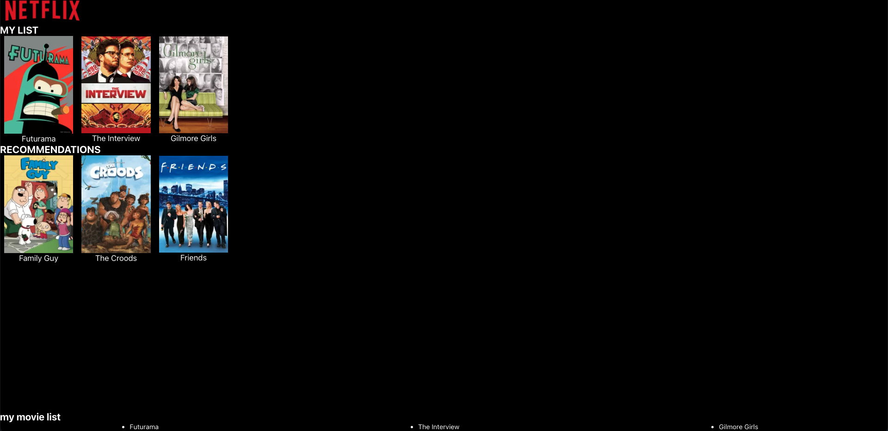

# Netflix Mock

## Quick Start

1. clone this repo

```
git clone https://github.com/LeoYangFrontend/Netflix_mock.git
```

```
cd Netflix_mock
```

2. Install and run server

```
npm i && npm run server
```

1. start

```
npm start
```

## Demo

**This Demo is don't have a backend to retrieve data**

Please Open In **Safari**

https://leoyangfrontend.github.io/Netflix_mock/

## Screen Shot



## Feature should provide

-   [x] The top row will be the ‘My List’ row and will display the titles included in ‘mylist’ array.

-   [x] The second row will be the recommendation row which will display the titles included in ‘recommendations’ array.

-   [x] Hovering over an image in the ‘My List’ row should create a “Remove” button displayed below the image. Clicking on the button should remove the title from the “My List” row.

-   [x] Hovering over an image in the recommendations row should create an “Add” button displayed below the image. Clicking on the button should add the title to the “My List” row.

-   [x] The list of titles in the “My List” row should be displayed at the bottom of the page.

-   [x] Remove should move the title to recommended

-   [x] Put a netflix logo at the top left

-   [x] Ensure that a http call is made to retrieve data and not use JSON file as an object with data

-   [x] Render the data with a single template only and ensure that different functions are written for the same layout for add and remove

-   [x] PLEASE DO IT IN REACT AND REDUX

-   [x] Please create a git repository and push the code there and send across the link when complete.
